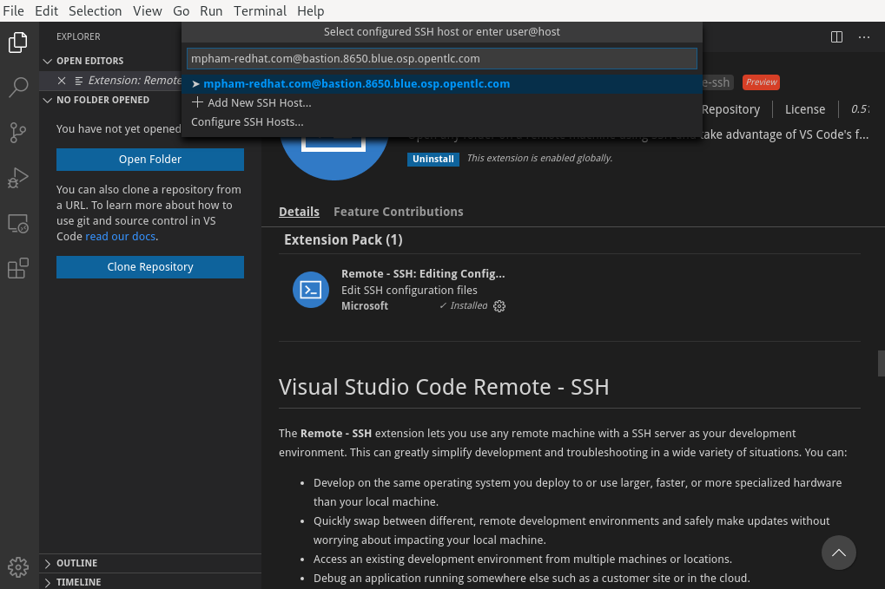
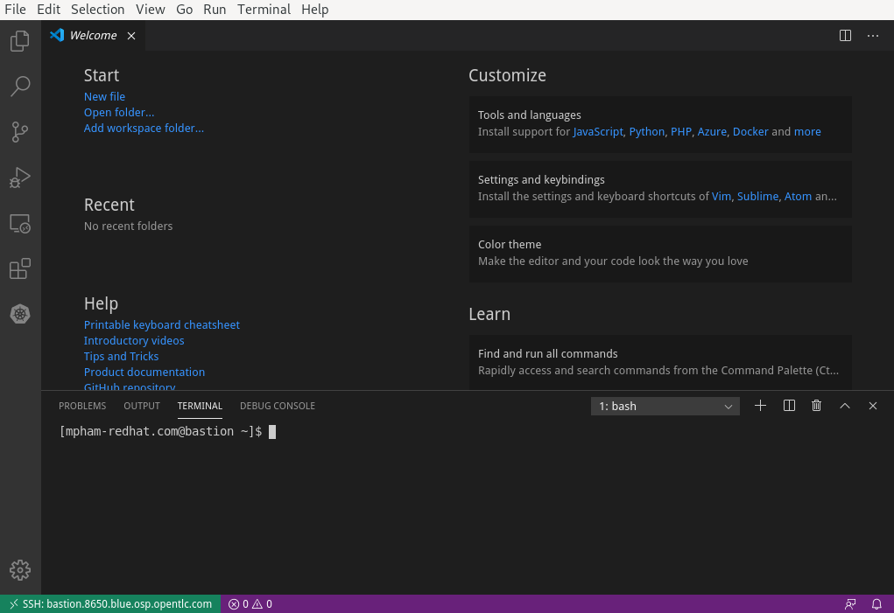
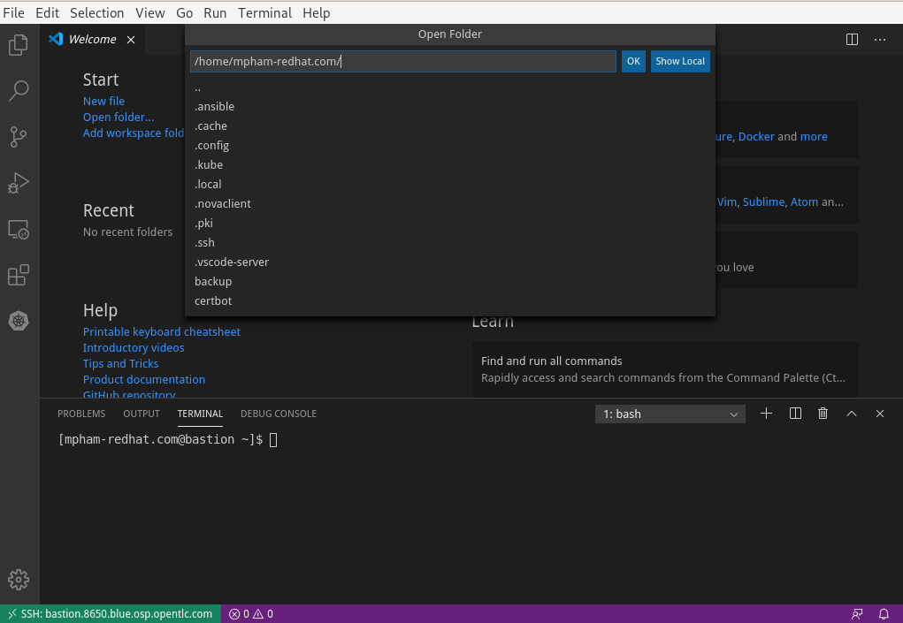
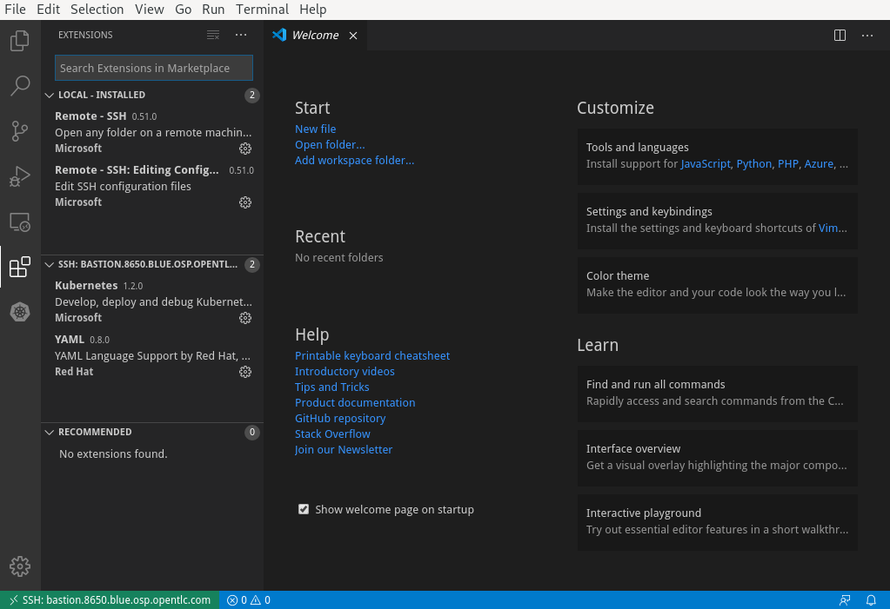

# SSH Workspace
## Install VsCode
On Fedora/RHEL/CentOS
```bash
$ sudo rpm --import https://packages.microsoft.com/keys/microsoft.asc
$ sudo sh -c 'echo -e "[code]\nname=Visual Studio Code\nbaseurl=https://packages.microsoft.com/yumrepos/vscode\nenabled=1\ngpgcheck=1\ngpgkey=https://packages.microsoft.com/keys/microsoft.asc" > /etc/yum.repos.d/vscode.repo'
$ sudo dnf check-update
$ sudo dnf install code
$ code
```
Go to extension menu (`Ctrl+Shift+X`)   


Search for and select `Remote-SSH` extension from Microsoft (should be the first one from the list)   


Install the extension   


Go to `View > Command Pallete (or Ctr+Shift+P)` and search for the command `Remote-SSH: Connect to host...`  to run a SSH session or `Remote-SSH: Add New SSH Host` to persist the host configurations for future usage.  


Input the hostname and enter. Add password/ssh key location when prompted      


After vscode connects successfully to the hostname, we should see the hostname at the bottom left. Also go to `Terminal > New Terminal` will give us the direct ssh session with the host.    


We then can have our remote workspace run on the host machine. Select `File > Open Folder (Ctrl+O)` to open the workspace   


We can also install extensions on the remote workspace such as `yaml` from Red Hat and `kubernetes`   


