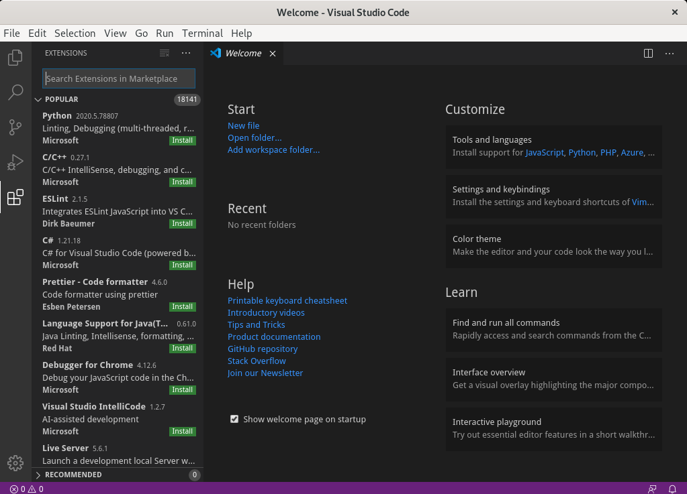
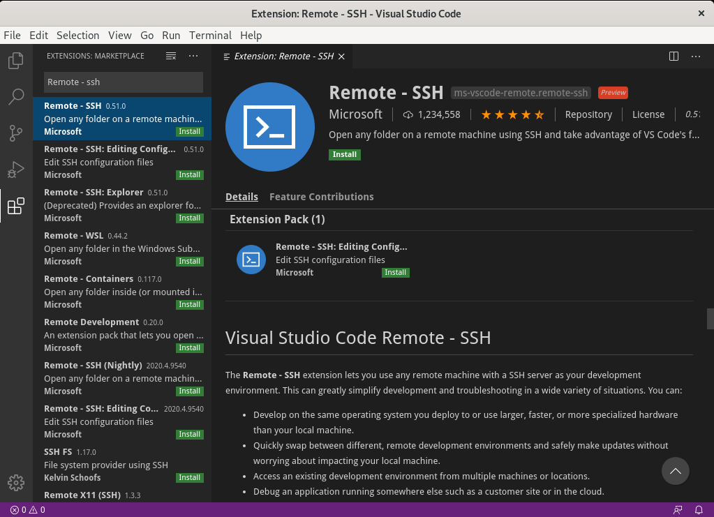
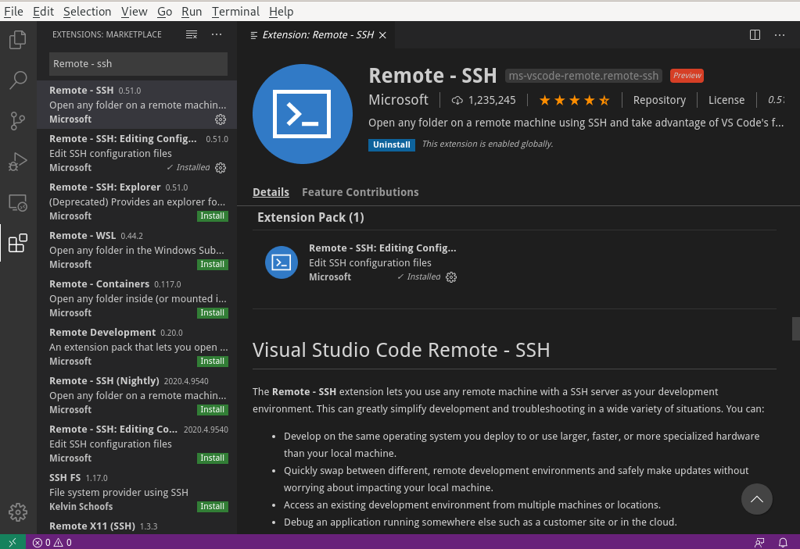
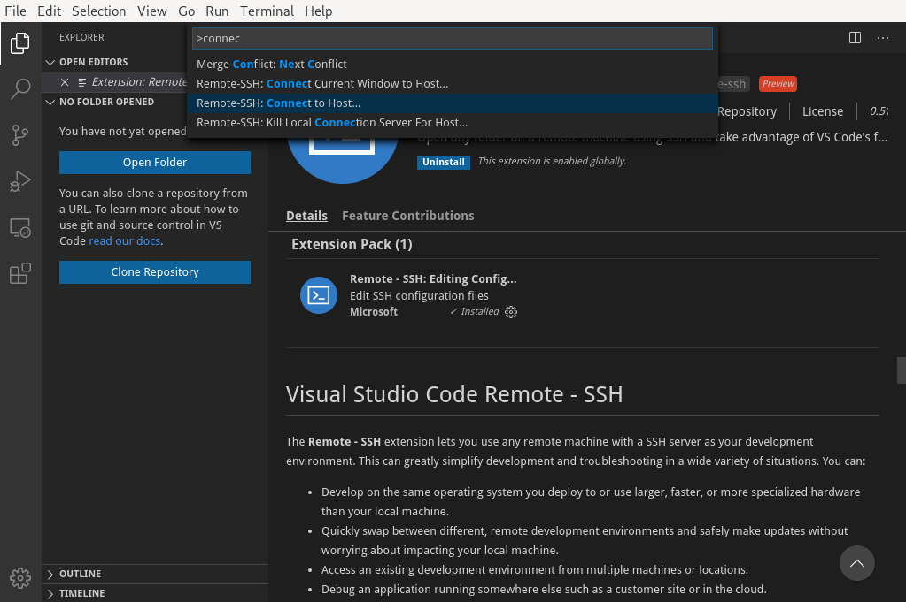

# SSH Workspace
## Install VsCode
On Fedora/RHEL/CentOS
```bash
$ sudo rpm --import https://packages.microsoft.com/keys/microsoft.asc
$ sudo sh -c 'echo -e "[code]\nname=Visual Studio Code\nbaseurl=https://packages.microsoft.com/yumrepos/vscode\nenabled=1\ngpgcheck=1\ngpgkey=https://packages.microsoft.com/keys/microsoft.asc" > /etc/yum.repos.d/vscode.repo'
$ sudo dnf check-update
$ sudo dnf install code
$ code
```
Go to extension menu (`Ctrl+Shift+X`)   


Search for and select `Remote-SSH` extension from Microsoft (should be the first one from the list)   


Install the extension   


Go to `View > Command Pallete (or Ctr+Shift+P)` and search for the command `Remote-SSH: Connect to host...`   


